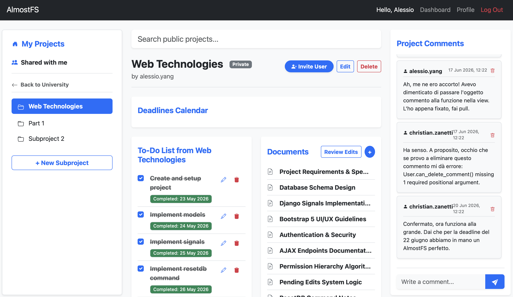
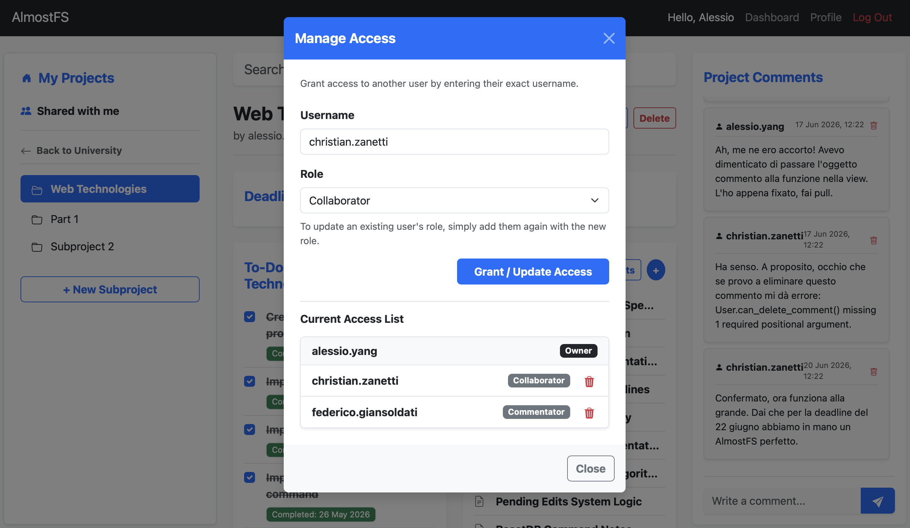
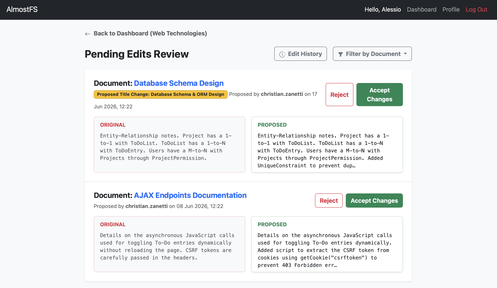
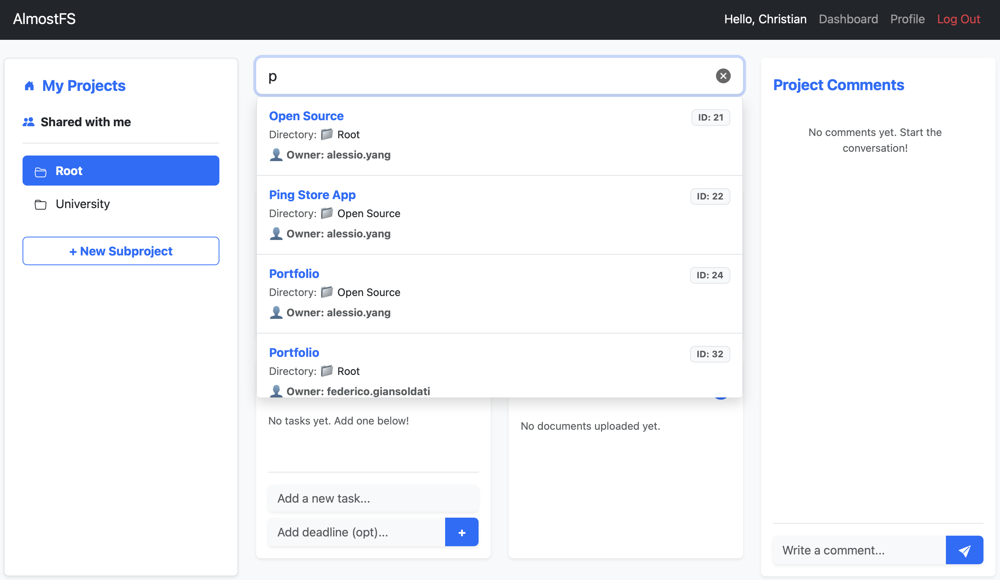

# AlmostFS

**AlmostFS** is a hierarchical project management web application built with Django. It features a file system-based structure, an advanced role-inheritance permission engine, asynchronous task management, and a collaborative document review workflow.

## Key Features

### Hierarchical Project Structure
* **Tree-Based Architecture:** Projects can be nested infinitely (Root -> Parent -> Child). Deleting a parent node triggers a recursive cascading delete of the entire subtree.
* **Single Root Constraint:** Each user is automatically provisioned with one and only one static root project via Django Signals.

### Live Public Search & Suggestions
* **AJAX-Powered Auto-complete:** A responsive live search bar allows users to discover public projects instantly. It queries the backend asynchronously on every keystroke without requiring a full page reload.
* **Optimized Database Queries:** To minimize database stress, the search endpoint utilizes `select_related` to fetch project owners and parent directories efficiently in a single query, capping results to the top 10 matches.

### Advanced Permission Engine
* **Single Source of Truth:** Permissions are assigned exclusively to the highest relevant parent node and evaluated dynamically at runtime across all descendants using Breadth-First Search (BFS) traversal.
* **Role Inheritance:** Users inherit access (Viewer, Commentator, Collaborator) down the project tree. The database is protected against redundant role assignments via custom `clean()` validation and SQL constraints.
* **Smart UI:** The frontend automatically detects and visually flags inherited permissions, directing project owners to the correct parent project to modify access rights.

### Collaborative Documents & Review Workflow
* **Pending Edits System:** Collaborators can propose modifications to existing documents without overwriting the live version.
* **Review Dashboard:** Project owners can review, accept, or reject pending edits.
* **Database-Level Locks:** Documents are locked against direct manual edits while pending proposals exist, achieved through a custom bypass flag injected during the automated `accept()` method.

### Asynchronous To-Do Lists
* **AJAX Integration:** To-do items can be toggled without page reloads using asynchronous JavaScript `fetch` calls.
* **Signal-Driven:** Every time a new project is created, a dedicated To-Do list is automatically generated behind the scenes.

### Project Comments
* **Role-Based Participation:** Project discussions are restricted to authorized personnel. Only Project Owners, Collaborators, and designated Commentators can post comments.
* **Owner Moderation:** Built-in moderation controls allow authors to delete their own messages, while granting the Project Owner rights to delete any comment within their project scope to ensure a safe collaborative environment.

---

## 📸 Screenshots

### Project Dashboard & Navigation

*The main project view showing nested subprojects, recent documents, and the asynchronous To-Do list.*

### Smart Permission Management

*The access management UI, highlighting the user roles.*

### Collaborative Document Review

*The document review interface where project owners can evaluate and accept/reject proposed changes.*

### Live AJAX Search

*Discovering public projects dynamically through the real-time search engine.*

---

## Tech Stack

* **Backend:** Python, Django
* **Frontend:** HTML5, CSS3, Bootstrap 5, JavaScript (AJAX)
* **Database:** SQLite (default) / PostgreSQL-ready (ORM agnostic)

## Architecture Highlights

* **Fat Models, Skinny Views:** Core business logic and permission checks are encapsulated directly within the Custom User model (`can_edit`, `can_view_parent`, etc.) and the Project model, adhering to clean architecture principles.
* **Defensive Programming:** The application employs multiple layers of validation. If the UI layer is bypassed, the database layer (via overridden `save()` and `clean()` methods) acts as a final barrier to ensure data integrity and prevent logical conflicts.
